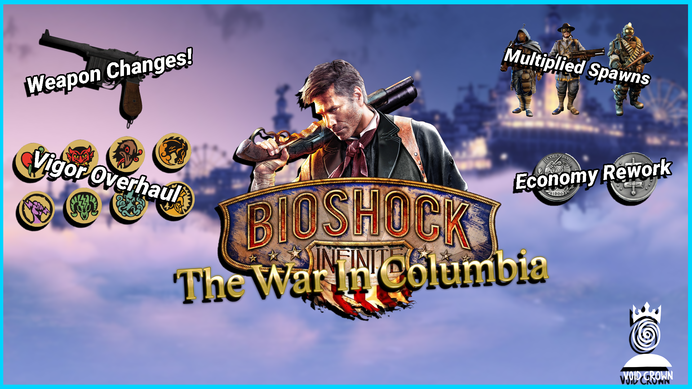

# The War In Columbia — BioShock Infinite Overhaul Mod



The War In Columbia is a comprehensive mod manager for BioShock Infinite that provides granular control over enemy spawns, weapon balance, and enemy health through a graphical interface.

This tool is designed to be educational and deconstructible. If you're interested in learning how BioShock Infinite modding works, understanding Unreal Engine 3 package formats, or building your own game modification tools, this repository serves as a complete reference implementation.

---

## Table of Contents

- [Overview](#overview)
- [What This Mod Does](#what-this-mod-does)
- [Features](#features)
- [How to Use](#how-to-use)
- [Technical Deep Dive](#technical-deep-dive)
  - [BioShock Infinite File Formats](#bioshock-infinite-file-formats)
  - [UE3 Package Format](#ue3-package-format)
  - [Runtime Spawn Multiplier](#runtime-spawn-multiplier)
  - [Crash Debugging Journey](#crash-debugging-journey)
- [File Structure](#file-structure)
- [Educational Resources](#educational-resources)
- [Requirements](#requirements)
- [Installation](#installation)
- [Usage Guide](#usage-guide)
- [Troubleshooting](#troubleshooting)
- [Contributing](#contributing)
- [License](#license)

---

## Overview

BioShock Infinite uses **Unreal Engine 3** (modified, codename "Icarus"). Unlike BioShock 1/2 which store balance data in INI archives, Infinite stores gameplay data as serialized object properties inside cooked UE3 packages (`.xxx` files).

This mod operates through two complementary approaches:

1. **Static Patching** — Python-based tool modifies cooked packages to change weapon damage, enemy health, and duplicate spawner exports
2. **Runtime Hooking** — Native DLL injection (`winmm.dll` proxy) hooks game functions at runtime to multiply enemy spawns dynamically

The runtime system is particularly innovative because it intercepts the spawn roster as it grows, clones enemy descriptors with proper deep-copy semantics, and injects them back into the game's spawn system—all without modifying any game files.

---

## What This Mod Does

The mod modifies BioShock Infinite by:

1. **UE3 Package Patching** — Binary-level modification of cooked `.xxx` packages containing:
   - Weapon damage values in `GlobalXItemDatabase_SF.xxx`
   - Enemy health archetypes in `Master_P.xxx`
   - Spawner actors in level packages (`S_TWN_P.xxx`, `S_BW_P.xxx`, etc.)

2. **Runtime Spawn Multiplication** — Native DLL injection hooks game functions to:
   - Intercept the spawn roster TArray as it grows during level loading
   - Deep-clone enemy descriptors with proper heap pointer detachment
   - Inject cloned enemies back into the spawn system
   - Apply memory gating to prevent crashes under heavy combat

3. **Crash Prevention** — Multiple defensive layers eliminate all known crash modes:
   - **Binary patch (JLE→JBE)** — Fixes a signed comparison bug in UE3's async stream reader that caused 4GB memcpy crashes during level transitions
   - **Pawn pool budget cap** — Limits total enemies per wave to prevent pool exhaustion (zombie spawns)
   - **Clone safety** — CountA forced to 1, runtime pointers zeroed, TArrays deep-copied
   - **Wwise audio pool 2x** — Prevents audio memory exhaustion under heavy combat
   - `FArchive::Serialize` guard blocks corrupt streaming reads (safety net)
   - memcpy backstop with 32MB hard cap (safety net)

---

## Features

### Spawn Multipliers (Runtime)
- **Budget-based multiplier** — Adds enemies up to a total cap of 20 per wave (small fights get many extras, large fights stay as-is)
- **Smart capping** — Counts base enemies from source descriptors first, only fills remaining budget with clones
- **Memory-gated spawning** — Only injects extra enemies when sufficient RAM is available (500MB+ free)
- **Deep-copy cloning** — TArrays get their own engine-allocated buffers (no double-free)
- **Pool-safe** — Never exceeds pawn pool capacity (prevents zombie/idle enemies)
- **Damage registration preserved** — Spawner/Delegate fields kept intact for proper combat behavior
- **Zero crashes** — 26-minute sessions with no stability issues after all fixes deployed

### Weapon Balance (Runtime + Static)
- **Fire rate** — Runtime patch: machine gun modified to 0.03s interval (~2000 RPM minigun) ✅
- **Magazine size** — Runtime patch: machine gun clip set to 100 rounds ✅
- **Reserve ammo** — Runtime patch: machine gun reserve set to 900 rounds ✅
- **Vigor salt costs** — Runtime patch: all vigor costs halved ✅
- **Damage values** — Static: granular control over every weapon type
- **Ammo capacity** — Static: max carry amounts per ammo type
- **Persistent across levels** — Weapon patch thread runs continuously, re-applies on level transitions

### Vigor Combinations (Runtime)
- **Hell's Rodeo** — Bucking Bronco + Devil's Kiss: enemies are lifted AND set on fire ✅
- **Technique** — Copy DamageType data fields from one vigor into another while preserving the UObject header (class vtable stays intact, so both effects apply)
- **Rename** — "Bucking Bronco" → "Hell's Rodeo" in all UI strings + localization file ✅
- **Extensible** — Same pattern works for any future vigor fusions (primary class = primary effect, copied data = secondary effect)

### Weapon Carry Limit (Implementation Ready)
- **Goal** — Increase from 2 weapons to 4 via mouse wheel cycling
- **Discovery** — The game already stores ALL weapons in a 36-slot array; the 2-weapon limit is purely in the cycling logic (`NextWeapon` only toggles between 2 indices)
- **Approach** — Override `NextWeapon` to cycle through 4 populated weapon slots instead of toggling between 2
- **Status** — Full structure mapped, `SetEquippedWeaponIndex` identified; implementing 4-weapon cycle

### Enemy Health (Static)
- **Health tuning** — Per-enemy-type health multipliers
- **Enemy types** — Soldiers, Automatons (Patriots, Mosquitoes, Turrets), Handymen, Sirens, Firemen, Crows

---

## How to Use

### Quick Start

1. **Run the mod manager:**
   ```bash
   python war_in_columbia.py
   ```

2. **Adjust settings** across the tabs to your preference.

3. **Click "Apply Mod"** — the tool backs up originals, then patches everything.

4. **Launch BioShock Infinite** and start a new game.

5. **Click "Restore All"** at any time to revert to vanilla.

### Detailed Tab Guide

#### SPAWNS Tab
- Runtime spawn multiplier (budget-based, configurable in `ue3_spawn.cpp`)
- Budget cap: MAX_TOTAL_ENEMIES=20 per wave (pool-safe)
- Memory gating prevents crashes under heavy combat (500MB+ headroom)
- Small encounters get significantly more enemies; large battles unchanged
- All spawned enemies have full AI, damage registration, and proper behavior

#### WEAPONS Tab
- Adjust weapon damage values
- Fire rate, magazine size, spread adjustments
- Ammo max carry capacity

#### ENEMIES Tab
- Base health values per enemy type
- Health, Max Health adjustments
- Affects all levels globally

---

## Technical Deep Dive

This section is for modders and developers who want to understand how BioShock Infinite modding works at a technical level. The War In Columbia serves as a complete reference implementation.

### BioShock Infinite File Formats

#### UE3 Cooked Packages

BioShock Infinite stores game data in Unreal Engine 3 cooked packages with the `.xxx` extension. These are seek-free optimized packages designed for console performance.

```
XGame/CookedPCConsole_FR/
├── GlobalXItemDatabase_SF.xxx    # Item/weapon database
├── Master_P.xxx                  # Persistent level with archetypes
├── S_TWN_P.xxx                   # Town Center level
├── S_BW_P.xxx                    # Battleship Bay level
└── ...
```

### UE3 Package Format

Package Structure:

```
Header (64 bytes):
- Signature (0x9E2A83C1 for UE3)
- Package version (727 for BioShock Infinite)
- Licensee version (75)
- Name table offset/count
- Import table offset/count
- Export table offset/count

Name Table:
- String entries with length and null terminator
- Used for all object names, property names

Import Table:
- References to objects in other packages
- Class package, class name, outer package, object name

Export Table:
- Local object definitions
- Class reference, super reference, object name
- Serial data offset and size
- Flags and other metadata

Serial Data:
- Actual object data (properties, arrays, structs)
- Variable-length depending on object type
```

### Runtime Spawn Multiplier

The runtime spawn multiplier is implemented as a native DLL injection via `winmm.dll` proxy. This is the most technically sophisticated part of the mod.

#### Architecture

```
winmm.dll (proxy)
├── InitSpawnHook() — installs MinHook patches + launches threads
│   ├── Hook_SpawnRoster() — intercepts TArray growth
│   ├── Hook_ArSerialize() — guards corrupt streaming reads
│   ├── Hook_SerDispatch() — upstream serialize guard
│   ├── Hook_memcpy() — backstop with VirtualQuery clamping
│   ├── WeaponStatPatchThread() — runtime weapon/vigor stat modification
│   │   ├── Fire rate, ammo, salt cost patching
│   │   ├── Runs continuously (every 30s after initial burst)
│   │   └── Two-phase: archetype collection → instance patching
│   ├── VigorRenamePatchThread() — vigor display name renaming
│   └── VigorCombineThread() — vigor effect fusion (Hell's Rodeo)
│       ├── Finds Bronco (XWeaponRollingThunder) + DevilsKiss (XWeapon)
│       ├── Copies DamageType data fields (preserves UObject header)
│       └── Result: lift + fire stacked via class polymorphism
└── CrashVEH() — vectored exception handler for crash logging
```

#### Spawn Roster Hook

The `Hook_SpawnRoster` function intercepts the game's spawn roster as it grows:

```cpp
static void ApplyRosterGrow(void* roster)
{
    // Detect when Num increases (new wave)
    if (num > lastNum) {
        // Calculate desired multiplier (5x default)
        int want = num * g_RosterMult;
        want = min(want, maxc);        // clamp to allocation
        want = min(want, g_MaxWaveTotal); // clamp to abs cap

        // Memory gating: only spawn if enough RAM
        if (MemMonLargestFreeMB() >= needMB) {
            // Deep-copy clone each enemy descriptor
            for (int i = 0; i < add; ++i) {
                memcpy(dst, src, DESC_STRIDE);
                // Detach heap pointers to prevent double-free
                CloneDetachTArray(dst, src, ...);
                // Nudge position to prevent overlap
                dst->x += 96.0f * (i + 1);
            }
            *roster->num = want;
        }
    }
}
```

#### Deep-Copy Semantics

The most critical technical challenge is preventing double-free crashes when cloning enemy descriptors. Each `AISpawnInfo` contains embedded TArrays with heap-allocated buffers:

```cpp
struct AISpawnInfo {
    // ... property data ...
    TArray* inventory;    // +0x08: heap-owned buffer
    TArray* equipment;    // +0x20: heap-owned buffer
    TArray* spawnPoints; // +0x30: heap-owned buffer
    // ... more heap-owning fields ...
};

// Shallow memcpy would alias these pointers -> double-free on cleanup
// Deep-copy allocates new buffers and copies data safely
static void CloneDetachTArray(char* dst, char* src, const ArrFieldInfo& f)
{
    if (f.deepCopy && elemSize > 0 && count > 0) {
        void* nd = Realloc(nullptr, capacity, 8);
        memcpy(nd, srcData, count * elemSize);
        dst->data = nd;  // Detached: new buffer, no alias
    } else {
        memset(dst, 0, 12); // Fallback: empty TArray
    }
}
```

### Crash Debugging Journey

This mod encountered a persistent crash during heavy combat and level streaming. The debugging journey is documented here as an educational case study.

#### The Problem

- **Symptom**: Fatal crash with ~1GB memcpy use-after-free
- **Location**: Out-of-combat, during level streaming
- **Frequency**: Random, but reproducible on certain routes
- **Stack trace**: Misleading — crash dialog showed wrong function

#### Investigation Steps

1. **Added VEH (Vectored Exception Handler)** for accurate crash logging
2. **Hooked `FArchive::Serialize`** at RVA 0xEBA70 to block corrupt reads
3. **Discovered hook bypass** — 15.8M calls but 0 blocks, crash still occurred
4. **Added hook byte diagnostics** to detect patch reversion
5. **Hooked upstream dispatcher** at RVA 0x80D00 (called directly, not via vtable)
6. **Applied config fixes** — disabled texture file cache, increased pool size
7. **Implemented memcpy backstop** — IAT hook at RVA 0xD455C with VirtualQuery clamping

#### Key Insights

- **Stale stack frames** — Validated return addresses were false positives from old stack garbage
- **Hook bypass** — The corrupt call path bypassed both serialize hooks entirely
- **True caller discovery** — Only by hooking memcpy itself could we get the real caller via `_ReturnAddress()`
- **VirtualQuery clamping** — Detects source buffer committed extent and clamps copy size to prevent walking off pages

#### Final Solution

The memcpy backstop hook is the definitive fix:

```cpp
static void* __cdecl Hook_memcpy(void* dst, const void* src, size_t count)
{
    if (count >= 64 MB) {
        // Query source buffer's committed extent
        VirtualQuery(src, &mbi, sizeof mbi);
        size_t safe = regionEnd - (uintptr_t)src;

        // Log true caller for debugging
        uintptr_t ra = _ReturnAddress();
        SLog("MEMCPY-GUARD: count=%Iu src_readable=%Iu caller=0x%p",
             count, safe, ra);

        // Clamp to prevent overrun crash
        if (count > safe) {
            count = safe;
            if (count == 0) return dst; // No-op
        }
    }
    return Real_memcpy(dst, src, count);
}
```

---

## File Structure

```
TheWarInColumbia/
├── war_in_columbia.py           # Main mod manager GUI (tkinter)
├── settings.json                # User configuration (game path)
├── README.md                    # This file
├── TheWarInColumbia2.png        # Mod logo
├── core/
│   ├── __init__.py              # Package init
│   ├── ue3_parser.py            # UE3 package format reader/writer
│   ├── property_patcher.py     # UE3 property value scanner/patcher
│   ├── spawn_patcher.py        # Spawner duplication in level packages
│   ├── game_data.py            # BioShock Infinite specific data
│   └── lzo.py                  # LZO decompression for cooked packages
├── native/
│   ├── CMakeLists.txt          # Native build configuration
│   ├── src/
│   │   ├── ue3_spawn.cpp       # Runtime spawn multiplier + crash guards
│   │   ├── ue3_spawn.h         # Header
│   │   ├── mem_monitor.cpp     # Memory monitoring for gating
│   │   ├── mem_monitor.h       # Header
│   │   ├── winmm_proxy.cpp     # winmm.dll proxy for DLL injection
│   │   ├── winmm_proxy.def     # Export definitions
│   │   └── winmm_forwards.h    # Forward declarations
│   ├── analysis/
│   │   ├── ue3_analyze.py      # Static analyzer for BioShock Infinite
│   │   ├── ak_exports.py       # Wwise API export listing
│   │   ├── ak_nearest.py       # Crash address symbol resolution
│   │   ├── find_gnames.py      # GNames array locator
│   │   └── ADDRESSES.md        # Key function RVAs
│   ├── tools/                  # Live-process reverse engineering scripts
│   │   ├── dump_attrib_struct.py  # Dumps XAttributeModifiedValue structs
│   │   ├── find_offset_field.py   # Discovers UProperty::Offset field position
│   │   ├── probe_max_attrib.py    # Probes MaxAmmo/MaxSpare attrib structs
│   │   ├── walk_props_v2.py       # Walks XWeapon property chain
│   │   ├── find_radial.py         # Weapon/vigor radial menu RVA finder
│   │   └── ...                    # Additional probing/diagnostic tools
│   └── build/                  # CMake build output
│       └── bin/Release/winmm.dll
├── tools/
│   ├── investigate_spawners.py  # Spawner analysis tool
│   └── memory_monitor.py       # Memory monitoring utility
├── backups/                     # Unmodified package copies (auto-created)
└── logs/                        # Operation logs
```

---

## Educational Resources

### For Beginning Modders
- **UE3 Package Format**: Understanding cooked packages is fundamental to modding BioShock Infinite
- **Property Serialization**: Learn how Unreal Engine serializes object properties to disk
- **TArray Structure**: Dynamic arrays are ubiquitous in UE3 — understand their in-memory layout

### For Advanced Modders
- **DLL Injection**: The `winmm.dll` proxy technique is a clean way to inject code into Windows games
- **MinHook**: Modern function hooking library for x86/x64 — essential for runtime modification
- **Memory Gating**: Preventing crashes under heavy load requires careful memory monitoring
- **Deep-Copy Semantics**: Properly cloning complex structures with heap-allocated data

### Key Concepts to Research
- **Unreal Engine 3 Architecture**: Object system, reflection, serialization
- **Cooked Packages**: Seek-free optimization for console performance
- **VirtualQuery API**: Windows API for querying memory region properties
- **Vectored Exception Handling**: Structured exception handling for crash diagnostics

---

## Requirements

- **Python 3.10+**
- **tkinter** (included with standard Python on Windows)
- **Visual Studio 2022** or **Build Tools for Visual Studio 2022** (for native DLL compilation)
- **CMake 3.20+** (for native build system)
- **MinHook** (included as git submodule in `native/deps/minhook`)

---

## Installation

### Option 1: Clone from GitHub

```bash
git clone https://github.com/NykoDesigns/The-War-In-Columbia.git
cd The-War-In-Columbia
```

### Option 2: Download Release

Download the latest release from https://github.com/NykoDesigns/The-War-In-Columbia/releases

### Building the Native DLL

```bash
cd native
cmake -B build -DCMAKE_BUILD_TYPE=Release
cmake --build build --config Release
```

The built `winmm.dll` will be deployed to your BioShock Infinite directory automatically.

---

## Usage Guide

### Applying the Mod

1. Run `python war_in_columbia.py`
2. The GUI will detect your BioShock Infinite installation automatically
3. Adjust settings across the tabs
4. Click "Apply Mod" — original files are backed up to `backups/pristine/`
5. Launch BioShock Infinite

### Restoring Vanilla

Click "Restore All" in the GUI to revert all changes from backups.

### Saving/Loading Presets

Use the "Save Preset" and "Load Preset" buttons to save your configuration to a JSON file.

### Important Notes

- **Runtime spawn multiplier** requires the `winmm.dll` to be present in `Binaries/Win32/`
- **Static changes** (weapons, health) require restarting the game to take effect
- **Spawn changes** take effect on level transitions or new game loads

---

## Troubleshooting

### "Game path not found"
- Manually set the game path in `settings.json`
- Ensure BioShock Infinite is installed via Steam

### "Failed to patch package"
- Ensure game files are not read-only
- Verify you have write permissions to the game directory
- Check that `backups/pristine/` exists and contains original files

### "Changes not appearing in game"
- Static changes require game restart
- Spawn changes require level transition
- Verify `winmm.dll` is deployed to `Binaries/Win32/`

### Crashes during gameplay
- Check `wic_log.txt` for crash diagnostics
- Ensure `winmm.dll` is the correct version
- Lower spawn multiplier if memory is insufficient

---

## Contributing

This project is provided as-is for educational purposes. If you have improvements or bug fixes, feel free to submit issues or pull requests.

### Development Guidelines

- Maintain the educational nature of the code
- Add comments explaining technical decisions
- Update documentation for any new features
- Test thoroughly before submitting changes

---

## Level Map Reference

| Internal Name | Location |
|--------------|----------|
| S_Light_P | Lighthouse |
| S_TWN_P | Town Center (Welcome Center, Fair, Streets) |
| S_TWN2_P | Town Center 2 (Rooftops, Monument) |
| S_TWN3_P | Town Center 3 (Gondola, Comstock Gate) |
| S_LizT_P | Monument Island (Elizabeth's Tower) |
| S_BW_P | Battleship Bay / Boardwalk |
| S_BW2_P | Soldier's Field / Hall of Heroes |
| S_BW3_P | Hall of Heroes Interior |
| S_Fink_P | Finkton Proper |
| S_Fink2_P | Finkton Docks / Shantytown |
| S_Fink3_P | Finkton Factory |
| S_Fink4_P | Finkton Hub / Bull Yard |
| S_EMP_P | Emporia |
| S_EMP2_P | Emporia 2 (Bank, Downtown) |
| S_DCOM_P | Comstock House |
| S_CHU_P | Hand of the Prophet / Final Battle |
| S_Lut_P | Sea of Doors / Ending |

---

## License

This project is provided as-is for modding purposes. BioShock Infinite is the property of 2K Games / Take-Two Interactive.

The code in this repository is released for educational use. Feel free to learn from it, adapt it, and use it as a reference for your own modding projects.
